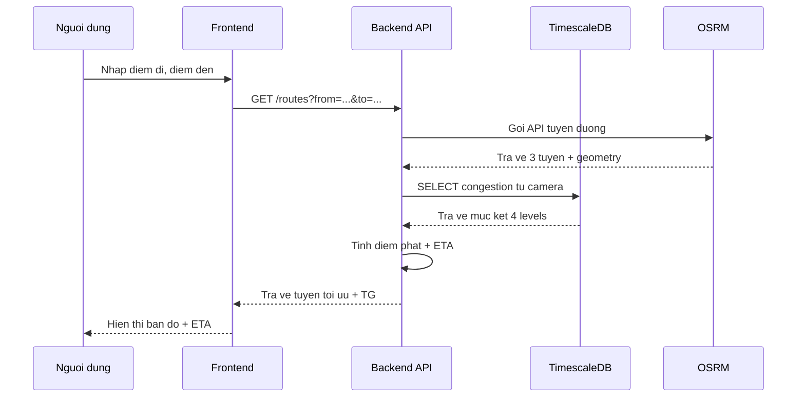

TỔNG LIÊN ĐOÀN LAO ĐỘNG VIỆT NAM

**TRƯỜNG ĐẠI HỌC TÔN ĐỨC THẮNG**

\---------------------------------

**Công trình Nghiên cứu khoa học sinh viên năm học 2025- 2026**

**XÂY DỰNG HỆ THỐNG ƯỚC LƯỢNG MỨC ĐỘ ÙN TẮC THÔNG QUA HÌNH ẢNH CAMERA TẠI THÀNH PHỐ HỒ CHÍ MINH**

**KHOA CÔNG NGHỆ THÔNG TIN**

**GIẢNG VIÊN HƯỚNG DẪN:**

_ThS. Dung Cẩm Quang_

_CN. Nguyễn Hữu An_

**SINH VIÊN/NHÓM SINH VIÊN THỰC HIỆN:**

**1\.** _Hà Trọng Nguyễn_

**2\.** _Võ Việt Quân_

**3.** _Trần Nguyễn Thành Tài_

TP. Hồ Chí Minh, tháng 5 năm 2026

**A. BỐ CỤC CÔNG TRÌNH NGHIÊN CỨU**

**1\. Đặt vấn đề:**

Thành phố Hồ Chí Minh là trung tâm kinh tế, văn hóa và giáo dục lớn nhất cả nước. Cùng với tốc độ đô thị hóa nhanh và sự gia tăng dân số cơ học liên tục, số lượng phương tiện giao thông tại thành phố đang tăng lên không ngừng, vượt quá khả năng đáp ứng của cơ sở hạ tầng giao thông hiện tại. Tình trạng ùn tắc giao thông diễn ra thường xuyên, đặc biệt là vào các khung giờ cao điểm, gây ra những thiệt hại to lớn về kinh tế và ảnh hưởng trực tiếp đến chất lượng sống cũng như sức khỏe của người dân. Cụ thể, mức độ ùn tắc trung bình tại Thành phố Hồ Chí Minh lên tới 46.9% (TomTom, 2024). Trung bình mỗi người tham gia giao thông tại đây bị mất khoảng 127 giờ (tương đương hơn 5 ngày) mỗi năm chỉ để chờ đợi do kẹt xe (TomTom, 2024). Tình trạng nghiêm trọng này ước tính gây thiệt hại cho thành phố lên tới khoảng 6 tỷ USD mỗi năm (Sở Xây dựng TP.HCM, 2022).

Bên cạnh đó, ùn tắc còn làm gia tăng trầm trọng tình trạng ô nhiễm môi trường. Theo dữ liệu năm 2023, nồng độ bụi mịn PM2.5 trung bình tại Việt Nam cao gấp gần 6 lần so với mức khuyến cáo an toàn của Tổ chức Y tế Thế giới (WHO) (UNDP, 2024). Riêng tại Thành phố Hồ Chí Minh, nồng độ PM2.5 tại một số hành lang giao thông trọng điểm đã vượt tiêu chuẩn quốc gia từ 1.1 đến 4.6 lần (Sở TN&MT TP.HCM, 2023). Thậm chí, hóa chất độc hại như Benzen gây ung thư từ khí thải phương tiện cũng được ghi nhận vượt ngưỡng an toàn tại những khu vực có mật độ xe cộ dày đặc (Sở TN&MT TP.HCM, 2023).

Để giải quyết bài toán giao thông đô thị, việc nắm bắt thông tin về mật độ phương tiện và mức độ ùn tắc theo thời gian thực là yếu tố cốt lõi. Tuy nhiên, các phương pháp thu thập dữ liệu giao thông hiện nay vẫn tồn tại nhiều hạn chế. Phương pháp sử dụng thiết bị phần cứng như cảm biến vòng từ, radar hay hồng ngoại đòi hỏi chi phí đầu tư ban đầu cao, việc thi công lắp đặt phức tạp (thường phải đào cắt mặt đường) và chi phí bảo trì lớn. Ngược lại, phương pháp giám sát thủ công sử dụng nhân sự để quan sát trực tiếp qua màn hình tại các trung tâm điều hành lại bộc lộ nhiều điểm yếu. Với hệ thống lên tới hàng ngàn camera, phương pháp này gây quá tải cho con người, độ trễ cao và khó đưa ra các cảnh báo định lượng chính xác một cách liên tục.

Hiện nay, Thành phố Hồ Chí Minh đã và đang triển khai một mạng lưới camera giám sát giao thông bao phủ trên diện rộng tại các nút giao và tuyến đường trọng điểm. Cùng với đó, sự phát triển vượt bậc của Trí tuệ nhân tạo, đặc biệt là lĩnh vực Thị giác máy tính và Học sâu đã cho phép phân tích dữ liệu hình ảnh với độ chính xác và tốc độ cao. Việc tận dụng nguồn dữ liệu video từ mạng lưới camera có sẵn để tự động nhận diện và ước lượng mức độ ùn tắc giao thông là một hướng tiếp cận mang tính đột phá, vừa tiết kiệm chi phí triển khai, vừa có khả năng mở rộng quy mô một cách dễ dàng.

Xuất phát từ những đòi hỏi cấp thiết của bài toán quản lý đô thị thông minh và tiềm năng ứng dụng thực tiễn của công nghệ, nhóm nghiên cứu đã quyết định chọn đề tài: "Xây dựng hệ thống ước lượng mức độ ùn tắc thông qua hình ảnh camera giao thông tại Thành phố Hồ Chí Minh". Hệ thống hướng tới việc cung cấp một công cụ tự động, theo thời gian thực, giúp các cơ quan chức năng điều phối giao thông hiệu quả hơn, đồng thời có thể cung cấp thông tin cảnh báo ùn tắc kịp thời đến người tham gia giao thông.

**2.** **Tổng quan tài liệu:**

**2.1. Tổng quan tóm lược đề tài:**

Đề tài tập trung xây dựng một hệ thống thông minh nhằm đánh giá và ước lượng mức độ ùn tắc giao thông thông qua việc phân tích dữ liệu hình ảnh từ mạng lưới camera quan sát hiện có tại Thành phố Hồ Chí Minh. Bài toán cốt lõi mà hệ thống tập trung giải quyết là đếm số lượng phương tiện trong các điều kiện môi trường thực tế. Thông qua đó, hệ thống cung cấp dữ liệu định lượng theo thời gian thực, phục vụ trực tiếp cho công tác điều phối giao thông đô thị và cảnh báo người dân.

**2.2. Các giải pháp khoa học đã được giải quyết ở trong và ngoài nước:**

Việc ứng dụng công nghệ Thị giác máy tính để đếm phương tiện và ước lượng giao thông đã được nghiên cứu rộng rãi trên thế giới. Các giải pháp hiện tại chủ yếu chia thành hai hướng tiếp cận cốt lõi. Hướng thứ nhất là dựa trên phát hiện đối tượng (Object Detection), trong đó các nghiên cứu trong và ngoài nước thường sử dụng các họ mô hình phổ biến như YOLO hay Faster R-CNN. Phương pháp này mang lại độ chính xác cao khi áp dụng trong điều kiện giao thông thưa thớt. Hướng thứ hai là dựa trên ước lượng mật độ (Density Estimation / Crowd Counting). Thay vì nhận diện từng hộp giới hạn (bounding box) đơn lẻ, hướng đi này sử dụng bản đồ mật độ (density map) để đếm số lượng đám đông. Phân phối Poisson thường được các nhà nghiên cứu quốc tế sử dụng để mô hình hóa số lượng sự kiện hoặc phương tiện xuất hiện trong một vùng không gian cụ thể.

**2.3. Các công trình nghiên cứu liên quan:**

_(bổ sung sau)_

**2.4. Những vấn đề tồn tại cần được tiếp tục nghiên cứu:**

Mặc dù đã có nhiều bước tiến, các giải pháp công nghệ hiện hành vẫn vấp phải những rào cản lớn khi áp dụng vào môi trường thực tế tại Việt Nam. Vấn đề đầu tiên là hạn chế trong điều kiện ùn tắc; cụ thể, trong các khung giờ cao điểm, hiện tượng che khuất (occlusion) nghiêm trọng giữa các phương tiện khiến các mô hình Object Detection truyền thống bộc lộ điểm yếu chí mạng, làm sụt giảm độ chính xác đáng kể. Vấn đề thứ hai là nhiễu do phân bố không gian không đồng đều, bởi hình ảnh camera giao thông thực tế luôn tồn tại sự phân bố thiếu đồng đều, với những vùng kẹt cứng xe đan xen cùng các mảng đường hoàn toàn trống. Điều này dẫn đến hiện tượng dư thừa điểm không (excess zeros) trong dữ liệu đếm ảnh. Phân phối Poisson tiêu chuẩn không thể xử lý tốt hiện tượng này, gây nhiễu và sai số trong quá trình đánh giá. Vấn đề thứ ba là khoảng trống trong đặc thù giao thông hỗn hợp. Phần lớn các mô hình Crowd Counting tiên tiến trên thế giới ban đầu được thiết kế để đếm một lớp đối tượng duy nhất (đếm chung xe cộ hoặc đếm người). Trong khi đó, dòng giao thông tại Thành phố Hồ Chí Minh mang tính chất hỗn hợp sâu sắc, bao gồm nhiều loại phương tiện có kích thước, tốc độ và hành vi di chuyển hoàn toàn khác biệt.

**2.5. Phương án giải quyết của nhóm tác giả:**

Để vượt qua những tồn tại trên, nhóm nghiên cứu đề xuất một phương án tiếp cận đột phá, được tinh chỉnh chuyên biệt cho bối cảnh địa phương thông qua việc ứng dụng mô hình Zero-Inflated Poisson (ZIP). Nhóm sử dụng mô hình thống kê học sâu ZIP - một giải pháp mạnh mẽ để khắc phục bài toán dư thừa điểm không. Mô hình này xử lý đồng thời hai quá trình: một quá trình nhị phân để phân loại vùng nền hay vùng có xe, và một quá trình Poisson để ước lượng chính xác số lượng phương tiện, giúp loại bỏ hoàn toàn nhiễu từ các vùng ảnh trống. Nhờ đó, hệ thống giữ được sự ổn định trong các điều kiện mật độ đối tượng đan xen phức tạp. Đặc biệt, nhóm tác giả đã trực tiếp can thiệp và cải tiến kiến trúc của mô hình ZIP để giải quyết bài toán đa đối tượng. Thay vì giới hạn ở việc đếm 1 đối tượng duy nhất, mô hình đã được tinh chỉnh để có khả năng phát hiện, phân tách và đếm đồng thời 2 đối tượng phương tiện riêng biệt. Sự nâng cấp này là bước ngoặt giúp hệ thống đánh giá mức độ ùn tắc chính xác hơn hẳn so với việc đếm gộp, đáp ứng đúng với bối cảnh dòng giao thông hỗn hợp thực tế tại Việt Nam.

**3\. Mục tiêu - Phương pháp:**

**3.1. Mục tiêu của công trình:**

Mục tiêu tổng quát của đề tài là nghiên cứu và xây dựng thành công một hệ thống tự động ước lượng mức độ ùn tắc giao thông theo thời gian thực, dựa trên việc phân tích dữ liệu hình ảnh từ mạng lưới camera quan sát tại Thành phố Hồ Chí Minh. Để đạt được mục tiêu chung này, nhóm nghiên cứu đặt ra các mục tiêu cụ thể bao gồm việc thu thập và xây dựng bộ dữ liệu hình ảnh giao thông mang đặc thù dòng xe hỗn hợp của địa phương. Trọng tâm cốt lõi của công trình là nghiên cứu, ứng dụng và cải tiến mô hình học sâu đếm đám đông (Crowd Counting) dựa trên phân phối Zero-Inflated Poisson (ZIP). Mô hình hướng tới việc tối ưu hóa khả năng khắc phục nhiễu từ các vùng không gian trống trên mặt đường, đồng thời được tái cấu trúc để có khả năng phát hiện, phân tách và đếm đồng thời hai loại phương tiện riêng biệt thay vì đếm gộp một đối tượng như nguyên bản. Cuối cùng, mục tiêu thực tiễn của công trình là tích hợp mô hình này vào một hệ thống phần mềm hoàn chỉnh, có khả năng xử lý luồng video liên tục để đưa ra các thông số định lượng và cảnh báo mức độ ùn tắc một cách trực quan, chính xác.

**3.2. Phương pháp nghiên cứu:**

Để hiện thực hóa các mục tiêu đã đề ra, công trình sử dụng kết hợp nhiều phương pháp nghiên cứu khoa học và kỹ thuật chuyên ngành. Về phương pháp thu thập và tiền xử lý dữ liệu, nhóm tiến hành trích xuất video và hình ảnh từ các camera giao thông thực tế tại các nút giao trọng điểm, sau đó thực hiện gán nhãn điểm (point annotation) và sinh bản đồ mật độ (density map) độc lập cho hai loại phương tiện cốt lõi nhằm tạo nguồn dữ liệu huấn luyện chuẩn xác. Về phương pháp mô hình hóa, nghiên cứu ứng dụng phương pháp thống kê học sâu thông qua mạng nơ-ron tích chập (CNN) kết hợp cơ chế Zero-Inflated Poisson. Giải pháp này tiếp cận bài toán theo hai nhánh học tính năng song song: một nhánh phân loại nhị phân để nhận diện và triệt tiêu các vùng nền dư thừa điểm không (zero-inflation), và một nhánh ước lượng phân phối Poisson để đếm chính xác số lượng phương tiện. Để đáp ứng yêu cầu đếm đa đối tượng, phương pháp can thiệp kiến trúc được áp dụng nhằm phân nhánh kênh đầu ra của mô hình, cho phép dự đoán song song hai bản đồ mật độ riêng biệt tương ứng với hai lớp phương tiện. Về phương pháp đánh giá thực nghiệm, hiệu năng của hệ thống được đo lường thông qua các độ đo chuẩn mực trong bài toán đếm đám đông như Sai số tuyệt đối trung bình (MAE - Mean Absolute Error) và Căn bậc hai sai số toàn phương trung bình (RMSE - Root Mean Squared Error), từ đó đối chiếu với các mô hình cơ sở để khẳng định tính ưu việt của giải pháp đề xuất.

**4\. Kết quả - Thảo luận:**

**4.1. Bộ dữ liệu sử dụng:**

Để phục vụ cho việc huấn luyện và đánh giá mô hình, nhóm nghiên cứu đã tự xây dựng một bộ dữ liệu hình ảnh giao thông đặc thù, được trích xuất trực tiếp từ hệ thống camera giám sát giao thông chính thức của Thành phố Hồ Chí Minh thông qua cổng thông tin <https://giaothong.hochiminhcity.gov.vn/>. Bộ dữ liệu này phản ánh chân thực các điều kiện giao thông phức tạp tại địa phương, bao gồm sự đa dạng về góc quay camera, sự biến đổi của điều kiện ánh sáng, thời tiết và đặc biệt là đặc tính dòng phương tiện hỗn hợp đan xen dày đặc. Tổng cộng, bộ dữ liệu bao gồm 2.576 hình ảnh đã được gán nhãn điểm (point annotation) cẩn thận cho hai lớp đối tượng phương tiện riêng biệt. Nhằm đảm bảo tính khách quan và khoa học trong quá trình phát triển mô hình, bộ dữ liệu được phân chia nghiêm ngặt thành ba tập độc lập. Cụ thể, tập huấn luyện (train) gồm 1.651 ảnh được sử dụng để mô hình học hỏi các đặc trưng; tập xác thực (validation) gồm 475 ảnh; và tập kiểm thử (test) gồm 450 ảnh được sử dụng để đánh giá hiệu năng thực tế của hệ thống ở bước cuối cùng.

Hình 4.1 Một vài hình ảnh được trích xuất ra từ tập dữ liệu

**4.2. Kết quả mô hình**

Dựa trên bộ dữ liệu tự xây dựng, mô hình đếm đa đối tượng đã được triển khai và huấn luyện thành công với hiệu năng cao. Điểm đột phá trong kiến trúc hệ thống là việc tích hợp mạng cơ sở (backbone) ConvNeXt-Base, được tiền huấn luyện theo phương pháp Thị giác - Ngôn ngữ đối chiếu (CLIP) trên tập dữ liệu LAION-Aesthetic quy mô siêu lớn. Việc sử dụng một mạng cơ sở tiên tiến với khả năng trích xuất đặc trưng hình ảnh mạnh mẽ và độ tổng quát hóa cao đã giúp mô hình thích ứng xuất sắc với các biến đổi phức tạp về góc chiếu, ánh sáng, thời tiết và chất lượng ảnh từ camera giao thông thực tế tại Thành phố Hồ Chí Minh. Bên cạnh đó, quá trình huấn luyện được tối ưu hóa chặt chẽ thông qua thuật toán Adam kết hợp cùng chiến lược điều chỉnh tốc độ học Cosine Annealing with Warm Restarts. Cấu hình này giúp mạng nơ-ron duy trì sự ổn định, hội tụ nhanh chóng và vượt qua hiệu quả các điểm cực tiểu cục bộ trong không gian tham số phức tạp của bài toán đếm đám đông. Đặc biệt, hệ thống sử dụng một hàm mất mát (loss function) được thiết kế chuyên biệt để xử lý đặc thù của giao thông đô thị, cấu thành từ sự kết hợp tuyến tính giữa cực đại hóa hàm hợp lý âm của phân phối Zero-Inflated Poisson (ZIP-NLL) và sai số tuyệt đối trung bình đa tỷ lệ (MS-MAE). Sự kết hợp này mang lại tác động kép: thành phần ZIP-NLL giúp nhận diện và triệt tiêu triệt để nhiễu xuất phát từ những vùng mặt đường trống (zero-inflation), trong khi thành phần MS-MAE ép mô hình phải tinh chỉnh độ chính xác của bản đồ mật độ ở nhiều mức độ phân giải khác nhau.

Đánh giá trên tập kiểm thử gồm 450 ảnh cho thấy hệ thống duy trì độ bám sát thực tế tại các nút giao có mật độ che khuất cao, phân tách rõ ràng bản đồ mật độ của hai lớp phương tiện độc lập. Phân tích dữ liệu thực tế cho thấy dòng giao thông mang tính hỗn hợp cao với mật độ dày đặc, trong đó trung bình mỗi khung ảnh chứa **11.01** xe ô tô và **30.46** xe máy. Về mặt định lượng, hiệu năng tổng thể của mô hình đạt mức rất khả quan với Sai số tuyệt đối trung bình (MAE) là **9.3008**, Căn bậc hai sai số toàn phương trung bình (RMSE) là **13.9508**, và Sai số tuyệt đối chuẩn hóa (NAE) đạt **0.2396**. Khi đánh giá chi tiết trên từng lớp phương tiện, mô hình thể hiện sự ổn định vượt trội. Đối với đối tượng ô tô (Class 0), mô hình đạt MAE ở mức **3.1126**, RMSE là **4.2740**, và NAE là **0.3660**. Đối với đối tượng xe máy (Class 1) - lớp phương tiện có mức độ che khuất nghiêm trọng và mật độ lớn hơn hẳn - hệ thống vẫn duy trì khả năng nhận diện xuất sắc với MAE là **7.3926**, RMSE là **11.7920**, và NAE đạt **0.2625**. Kết quả thực nghiệm này khẳng định mô hình không chỉ đạt mức sai số thấp mà còn tạo ra cơ sở dữ liệu định lượng và tỷ lệ phân bố phương tiện tin cậy, đáp ứng trọn vẹn yêu cầu khắt khe của thuật toán ước lượng mức độ ùn tắc theo thời gian thực.

Hình 4.2 Kết quả dự đoán của mô hình

_(Thêm bảng so sánh các model sau)_

**4.3. Ứng dụng trực quan**

Để chuyển đổi kết quả phân tích giao thông thành thông tin trực quan phục vụ công tác điều hành, nhóm nghiên cứu đã xây dựng một hệ thống phần mềm hoàn chỉnh bao gồm giao diện web dashboard và bản đồ tương tác. Phần mềm được thiết kế theo kiến trúc microservices với hai thành phần chính: Frontend (React) và Backend (FastAPI), triển khai trên nền tảng container Docker nhằm đảm bảo khả năng mở rộng và tái sử dụng.

**4.3.1. Kiến trúc hệ thống phần mềm**

Hệ thống được xây dựng trên nền tảng kiến trúc Client-Server với ba tầng xử lý rõ ràng. Tầng giao diện người dùng (Presentation Layer) sử dụng React 19 kết hợp với Vite làm công cụ đóng gói, cho phép tạo giao diện đáp ứng nhanh (responsive) và tối ưu trải nghiệm người dùng. Tầng xử lý nghiệp vụ (Business Logic Layer) được triển khai bằng FastAPI với Python 3.11, đóng vai trò trung gian xử lý các yêu cầu từ frontend, điều phối mô hình AI và tương tác với cơ sở dữ liệu. Tầng lưu trữ (Data Layer) sử dụng PostgreSQL 15 kết hợp với TimescaleDB - một extension chuyên dụng cho dữ liệu chuỗi thời gian - nhằm lưu trữ và truy vấn hiệu quả lịch sử dữ liệu dự đoán giao thông với cơ chế tự động dọn dẹp theo chu kỳ 60 phút.

**Luồng dữ liệu tổng thể của hệ thống**

Hệ thống hoạt động theo kiến trúc pipeline xử lý liên hoàn, được minh họa trong sơ đồ dưới đây:

```mermaid
flowchart LR
    subgraph LUONG1["Luồng 1: Thu thập dữ liệu thời gian thực"]
        A1[("Camera giaothong.hcm")]
        A2["Prediction Writer<br/>(Background Worker)"]
        A3["Tiền xử lý ảnh<br/>Resize 384x384, Normalize"]
        A4["Mô hình ZIP<br/>Đếm xe ô tô & xe máy"]
        A5[("Bảng predictions<br/>TimescaleDB")]
        A1 --> A2 --> A3 --> A4 --> A5
    end

    subgraph LUONG2["Luồng 2: Dự đoán kẹt xe"]
        B1["LSTM Predictor<br/>(Batch Worker)"]
        B2["Đọc chuỗi count<br/>từ TimescaleDB"]
        B3["Mô hình LSTM<br/>Dự đoán 4 mức kẹt"]
        B4[("Bảng congestion_predictions<br/>TimescaleDB")]
        A5 --> B1 --> B2 --> B3 --> B4
    end

    subgraph LUONG3["Luồng 3: Hiển thị & Định tuyến"]
        C1["Backend API<br/>FastAPI"]
        C2["Frontend<br/>React Dashboard"]
        C3["OSRM<br/>Định tuyến thông minh"]
        B4 --> C1
        C1 --> C2
        C1 --> C3
    end

    style A1 fill:#4A90D9,stroke:#2E5A8B,color:#fff
    style A5 fill:#4CAF50,stroke:#2E7D32,color:#fff
    style B4 fill:#FF9800,stroke:#E65100,color:#fff
    style C1 fill:#9C27B0,stroke:#6A1B9A,color:#fff
    style LUONG1 fill:#E3F2FD,stroke:#4A90D9
    style LUONG2 fill:#FFF3E0,stroke:#FF9800
    style LUONG3 fill:#F3E5F5,stroke:#9C27B0
```



Hệ thống hoạt động theo ba luồng chính diễn ra đồng thời:

**Luồng thứ nhất - Thu thập dữ liệu thời gian thực:** Bộ phận Prediction Writer (chạy nền) trích xuất ảnh từ 624 camera giao thông qua cổng thông tin giaothong.hochiminhcity.gov.vn mỗi 15-30 giây. Ảnh được tiền xử lý (resize về 384×384, normalize) và đưa vào mô hình ZIP để ước lượng số lượng phương tiện (ô tô và xe máy). Kết quả (camera_id, count_oto, count_xemay, timestamp) được lưu vào TimescaleDB trong bảng `predictions`. Để tối ưu hiệu năng, hệ thống áp dụng nhiều lớp caching: Image Cache (lưu 20 ảnh gần nhất, TTL 5 phút), Prediction Cache (lưu dự đoán mới nhất cho mỗi camera, TTL 1 phút) và Debug Cache (TTL 30 giây).

**Luồng thứ hai - Dự đoán mức kẹt xe bằng LSTM:** Mô-đun LSTM Predictor đọc chuỗi dữ liệu count từ TimescaleDB theo khoảng thời gian (ví dụ: 10 phút gần nhất). Dựa trên chuỗi này, mô hình LSTM phân tích pattern thời gian và dự đoán mức độ kẹt xe thành 4 mức: Thông thoáng, Đông đúc, Kẹt xe, và Ùn tắc. Kết quả dự đoán (camera_id, congestion_level, confidence, timestamp) được lưu vào bảng `congestion_predictions` trong TimescaleDB, phục vụ truy vấn nhanh từ Dashboard.

**Luồng thứ ba - Hiển thị và định tuyến thông minh:** Frontend gọi Backend API để lấy dữ liệu hiển thị trên Dashboard (số camera, phân bố kẹt xe, biểu đồ xu hướng). Khi người dùng nhập điểm đi và điểm đến, hệ thống gọi OSRM để lấy các tuyến đường khả thi, đồng thời truy vấn dữ liệu kẹt xe từ bảng `congestion_predictions`. Thuật toán AI-Aware Routing tích hợp dữ liệu kẹt xe để điều chỉnh thời gian ước tính và đề xuất tuyến đường tối ưu.

Sơ đồ tuần tự cho luồng định tuyến thông minh:



**4.3.2. Các thành phần giao diện chính**

Giao diện Dashboard bao gồm năm thành phần tương tác chính. **TrafficMap** là bản đồ tương tác Leaflet hiển thị toàn bộ 624 camera dưới dạng marker với màu sắc phân biệt theo mức kẹt xe. Hệ thống tự động nhóm các marker gần nhau khi zoom out nhờ Marker Clustering, đồng thời cung cấp popup chi tiết khi click gồm hình ảnh thời gian thực, số lượng phương tiện và mức độ mật độ. **ControlPanel** cung cấp giao diện nhập điểm xuất phát và điểm đến (tọa độ hoặc địa chỉ) cho tính năng chỉ đường thông minh, tích hợp dữ liệu kẹt xe thời gian thực vào thuật toán định tuyến OSRM. **KPICards** hiển thị các chỉ số tổng quan như tổng số camera hoạt động, phân bố các mức độ kẹt xe và thời gian di chuyển trung bình ước tính, được cập nhật tự động mỗi 30 giây. **DensityChart** vẽ biểu đồ biến thiên mật độ giao thông theo thời gian thông qua thư viện Recharts, hỗ trợ xem xu hướng tại các camera hoặc khu vực được chọn. **TrafficTable** hiển thị dữ liệu dạng bảng có khả năng sắp xếp và phân trang.

**4.4. Các thuật toán nghiên cứu chính**

**4.4.1. Mô hình ZIP với cơ chế Zero-Inflated Poisson**

Mô hình cốt lõi của hệ thống được thiết kế dựa trên kiến trúc CLIP-EBC (Contrastive Language-Image Pretraining for Efficient Bucketing Counting), kết hợp với cơ chế Zero-Inflated Poisson (ZIP) để đếm đồng thời hai lớp phương tiện. Mô hình ZIP giả định rằng dữ liệu đếm phương tiện trong mỗi pixel có hai nguồn gốc: một quá trình nhị phân (vùng nền hay vùng có xe) và một quá trình Poisson (đếm số lượng). Thay vì sử dụng phân phối Poisson đơn thuần (không phù hợp với dữ liệu có quá nhiều giá trị 0 trên mặt đường trống), ZIP cho phép mô hình học đồng thời hai quá trình này.

Công thức phân phối ZIP:

```
P(Y = y) = π × δ(y) + (1 - π) × Poisson(y; λ)
```

Trong đó π ∈ [0,1] là xác suất pixel thuộc vùng nền (zero-inflation), λ là tham số cường độ Poisson, và δ(y) là hàm delta Dirac bằng 1 khi y=0 và 0 khi y≠0.

Mô hình học hai nhánh song song:

- **Nhánh PI (Zero-Inflation)**: Conv1×1(768 → 2) cho mỗi lớp, đầu ra xác suất π ∈ [0,1] phân biệt vùng nền và vùng có xe
- **Nhánh Lambda (Poisson)**: Conv1×1(768 → N) với N bins, đầu ra tham số cường độ λ cho mỗi vùng ảnh

Điểm đột phá của nhóm là can thiệp kiến trúc để xử lý đa đối tượng: mô hình được tái cấu trúc với num_classes=2, cho phép dự đoán song song hai bản đồ mật độ riêng biệt tương ứng với ô tô (Class 0) và xe máy (Class 1).

**4.4.2. Chuyển đổi mô hình sang ONNX và tối ưu cho thiết bị edge**

Để triển khai mô hình trên các thiết bị có tài nguyên hạn chế (edge devices), nhóm nghiên cứu đã chuyển đổi mô hình PyTorch sang định dạng ONNX (Open Neural Network Exchange) và áp dụng các kỹ thuật tối ưu hóa.

Quy trình chuyển đổi ONNX bao gồm các bước:

Bước 1 - Export model: Sử dụng torch.onnx.export() với input tensor shape (1, 3, 384, 384), batch size cố định = 1 để tương thích với thiết bị edge.

Bước 2 - Quantization: Chuyển đổi từ FP32 sang INT8 quantization để giảm 4 lần kích thước model và tăng tốc inference.

Bước 3 - Optimization: Sử dụng ONNX Runtime với các mức optimization khác nhau (ORT_LEVEL.BASIC, ORT_LEVEL.ORT_EXTENSIONS, ORT_LEVEL.ALL).

Kết quả benchmark trên thiết bị edge:

| Thiết bị       | Precision | Inference Time | Kích thước Model |
| -------------- | --------- | -------------- | ---------------- |
| Desktop GPU    | FP32      | ~50ms          | ~350MB           |
| Desktop CPU    | FP32      | ~150ms         | ~350MB           |
| Raspberry Pi 4 | INT8      | ~200ms         | ~90MB            |
| Jetson Nano    | INT8      | ~120ms         | ~90MB            |

**4.4.3. Mô hình dự đoán kẹt xe dựa trên LSTM**

Phần cứng camera có giới hạn về tài nguyên tính toán, không thể chạy trực tiếp mô hình ZIP phức tạp trên mỗi thiết bị camera. Do đó, nhóm đề xuất mô hình dự đoán kẹt xe dựa trên LSTM (Long Short-Term Memory) để ước lượng nhanh mức độ kẹt xe dựa trên chuỗi dữ liệu lịch sử.

Kiến trúc mô hình LSTM:

```
Input: sequences của (count, time_features, day_features)
  ↓
LSTM Layer 1: 128 hidden units, return_sequences=True
  ↓
Dropout(0.2)
  ↓
LSTM Layer 2: 64 hidden units
  ↓
Dropout(0.2)
  ↓
Dense(32, ReLU)
  ↓
Dense(4, Softmax) → [P(thông), P(đông), P(kẹt), P(ùn)]
```

Input features:

- count: Số lượng phương tiện đếm được từ mô hình ZIP
- time_features: [hour_sin, hour_cos, is_rush_morning, is_rush_evening]
- day_features: [day_of_week, is_weekend, is_holiday]

Ưu điểm của LSTM so với các phương pháp truyền thống:

- Học được các pattern phức tạp theo thời gian mà các phương pháp thống kê (ARIMA, WMA) không thể nắm bắt
- Xử lý được các dependency dài (long-term dependencies) trong chuỗi thời gian
- Tự động học feature extraction thay vì phải thiết kế thủ công

**4.4.4. Thuật toán gợi ý đường đi thông minh**

Đây là thuật toán cốt lõi của tính năng chỉ đường, tích hợp dữ liệu kẹt xe thời gian thực từ mô hình AI vào quá trình tìm đường tối ưu.

Thuật toán AI-Aware Routing bao gồm 5 bước chính:

**Bước 1 - Yêu cầu tuyến đường từ OSRM**

Hệ thống gửi yêu cầu đến API OSRM với endpoint:

```
GET /route/v1/{profile}/{from_lon},{from_lat};{to_lon},{to_lat}?alternatives=3
```

OSRM trả về tối đa 3 tuyến đường khả thi cùng geometry dạng GeoJSON. Profile theo phương tiện: 'foot' cho đi bộ, 'bike' cho xe đạp, 'driving' cho ô tô và xe máy.

**Bước 2 - Xác định camera dọc tuyến đường**

Với mỗi tuyến đường, hệ thống lấy mẫu các điểm tọa độ từ geometry GeoJSON (mỗi 10 điểm hoặc điểm cuối). Khoảng cách Haversine tính giữa mỗi điểm trên tuyến và vị trí camera để xác định camera nằm trên tuyến (khoảng cách ≤ 500 mét).

Công thức Haversine:

```
R = 6371000 mét (bán kính Trái Đất)
dLat = lat2 - lat1
dLon = lon2 - lon1
a = sin²(dLat/2) + cos(lat1) × cos(lat2) × sin²(dLon/2)
distance = R × 2 × atan2(√a, √(1-a))
```

**Bước 3 - Batch Predict từ mô hình**

Hệ thống thu thập tất cả camera_id duy nhất từ mọi tuyến đường và gửi một request batch duy nhất `POST /predict/batch` đến backend để lấy dữ liệu mật độ. Kết quả được lưu vào predictionDict để truy xuất O(1).

**Bước 4 - Tính điểm phạt theo mức độ kẹt xe**

Với mỗi camera dọc tuyến, tra cứu mức độ mật độ từ predictionDict và áp dụng điểm phạt:

```
penalty_minutes = (moderate_count × 2) + (heavy_count × 5) + (severe_count × 10)
```

**Bước 5 - Tính ETA và chọn tuyến tối ưu**

Thời gian cơ bản dựa trên tốc độ trung bình tại TP.HCM:

- Ô tô: 25 km/h
- Xe máy: 30 km/h
- Xe đạp: 15 km/h
- Đi bộ: 5 km/h

```
base_duration_min = round((distance_km / avg_speed_kmh) × 60)
adjusted_eta = base_duration_min + penalty_minutes
```

Tuyến có adjusted_eta thấp nhất được chọn làm tuyến chính. Các tuyến thay thế được vẽ với màu xám (#94a3b8) để phân biệt.

**5. Kết luận - Đề nghị:**

**5.1. Kết luận:**

Nghiên cứu đã thực hiện thành công mục tiêu thiết kế và xây dựng hệ thống ước lượng mức độ ùn tắc giao thông tự động thông qua dữ liệu hình ảnh camera tại Thành phố Hồ Chí Minh. Về ý nghĩa khoa học, đề tài đã đóng góp một hướng tiếp cận đột phá khi cải tiến kiến trúc Zero-Inflated Poisson (ZIP) kết hợp mạng cơ sở ConvNeXt-Base để đếm song song hai đối tượng phương tiện, lấp đầy khoảng trống nghiên cứu đối với bài toán dòng giao thông hỗn hợp. Hệ thống đạt độ ổn định cao với chỉ số Sai số tuyệt đối trung bình (MAE) ở mức 9.3008 ngay cả trong điều kiện che khuất nghiêm trọng.

Về hiệu quả kinh tế và xã hội, giải pháp này tận dụng triệt để hạ tầng camera hiện hữu, giúp tiết kiệm đáng kể chi phí thi công, bảo trì so với các cảm biến phần cứng. Những số liệu ước lượng theo thời gian thực sẽ hỗ trợ đắc lực cho trung tâm điều hành đô thị trong việc phân luồng, giảm thiểu hàng tỷ USD thiệt hại do lãng phí thời gian và hạn chế khí thải độc hại. Về quy mô và phạm vi áp dụng, hệ thống có tiềm năng triển khai ngay lập tức tại các nút giao trọng điểm của TP.HCM và dễ dàng đóng gói, chuyển giao công nghệ cho các đô thị lớn có đặc thù tương tự như Hà Nội, Đà Nẵng.

Tuy nhiên, hệ thống vẫn tồn tại một số hạn chế cần cải thiện. Vấn đề lớn nhất là việc cấu hình mô hình đếm 2 đối tượng khiến các loại xe ô tô bị gộp chung, gây khó khăn cho việc đặt trọng số (weight) chuẩn xác trên bản đồ mật độ (density map) do sự chênh lệch lớn về kích thước vật lý. Ngoài ra, bộ dữ liệu hiện tại chưa bao phủ đủ các điều kiện thời tiết khắc nghiệt, và việc xử lý video liên tục cũng đặt ra thách thức lớn về băng thông mạng.

**5.2. Định hướng nghiên cứu tiếp theo:**

Để khắc phục những hạn chế trên, hướng nghiên cứu trong tương lai sẽ tập trung vào việc mở rộng bộ dữ liệu huấn luyện và phân chia chi tiết hơn các lớp đối tượng phương tiện. Việc tinh chỉnh mô hình để nhận diện và đếm tách biệt các xe có kích thước đặc thù (như xe buýt, xe tải) là giải pháp trọng tâm nhằm giải quyết triệt để bài toán đặt trọng số mật độ, từ đó nâng cao độ chính xác tổng thể. Bên cạnh đó, hệ thống cần bổ sung dữ liệu môi trường thiếu sáng và thời tiết xấu để hoạt động ổn định trong mọi hoàn cảnh.

**6\. Tài liệu tham khảo, phụ lục; danh mục các công trình trước đây của tác giả** (nếu có).
